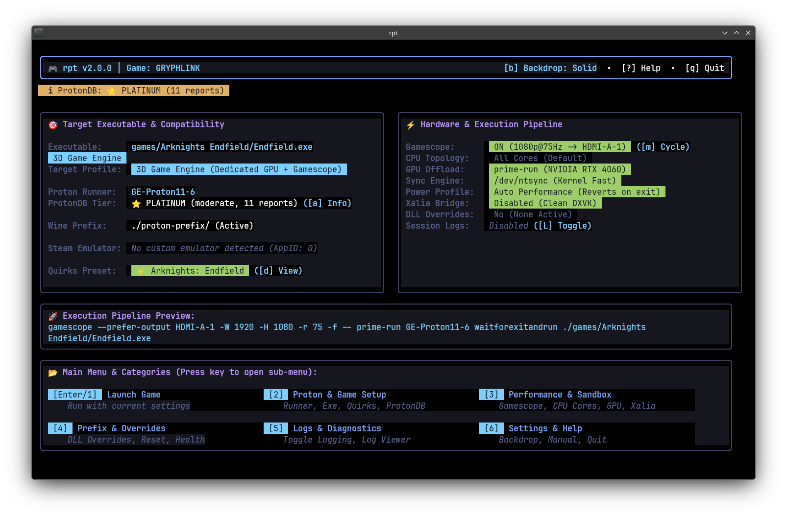
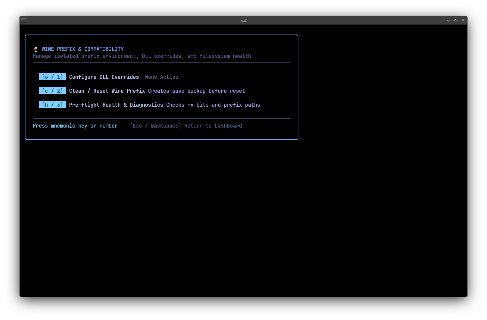
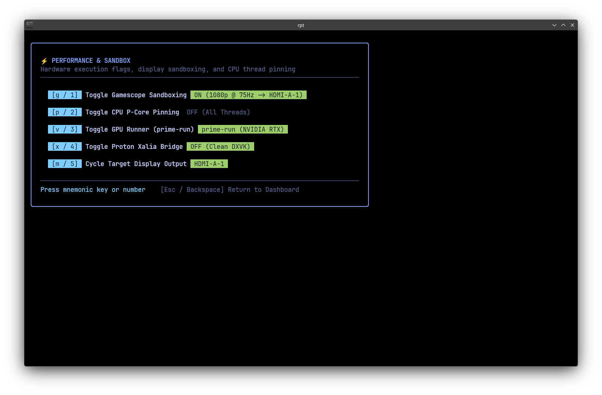
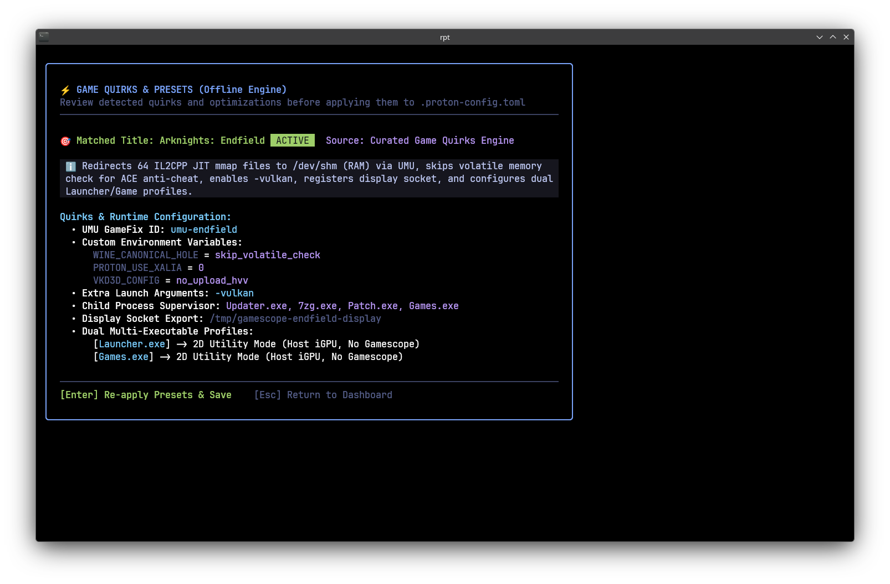
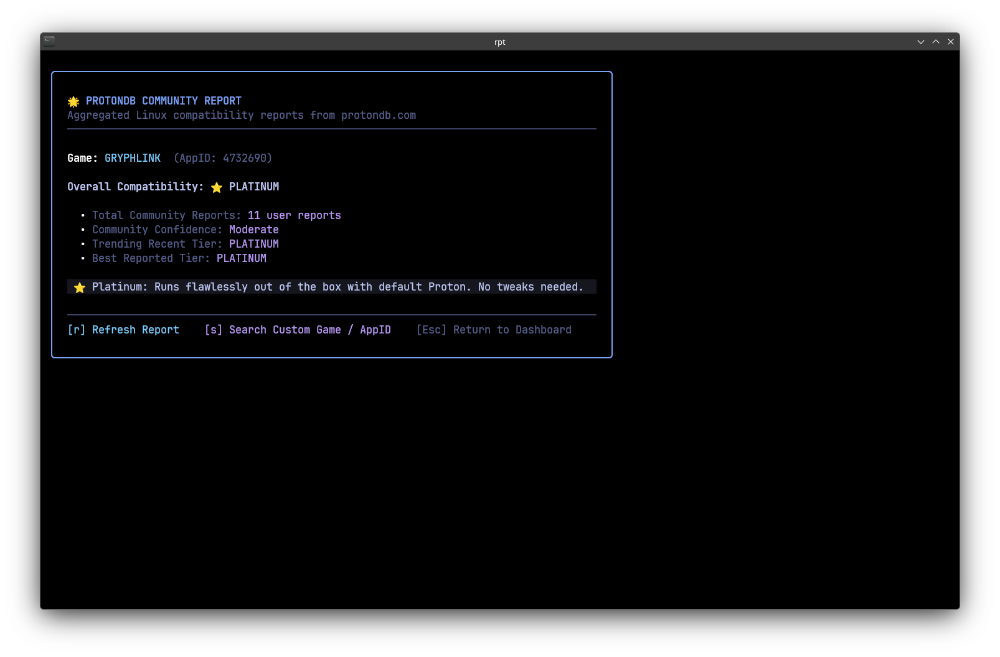
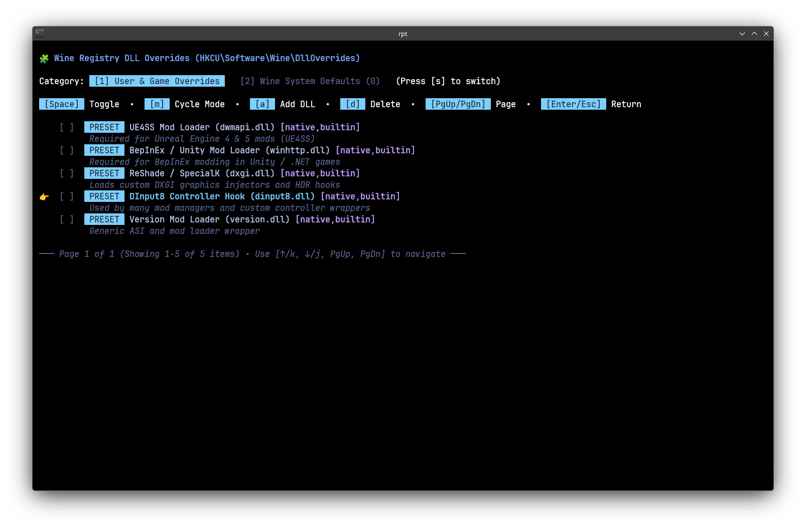

# rpt (Run Proton TUI) 🎮

[](LICENSE)
[](https://go.dev)
[](https://kernel.org)
[](https://github.com/broli/run-proton-tui/wiki)

**`rpt` makes running Windows games on Linux as simple as entering the game folder and typing `rpt`.**

Whether you are jumping into the main 3D game, running a setup installer (`Setup.exe`), updating through an official launcher (`Launcher.exe`), or applying a game patch, `rpt` handles the entire lifecycle automatically. No wrestling with complicated Wine prefixes, no memorizing dozens of launch flags, and no fear of accidentally deleting your save files. Just a clean, responsive terminal dashboard that gets your games running smoothly in seconds.

<p align="center">
  
</p>

---

## ⚡ The 10-Second Quickstart

You don't need to configure anything or select executables manually. Just open your terminal in any game folder:

```bash
cd ~/Games/MyGame
rpt
```

1. `rpt` automatically discovers your game.
2. It detects your best graphics card and tunes your CPU for maximum performance.
3. **Press `[Enter]` to play!**

Prefer to skip the menu and launch straight into the game?
```bash
rpt --now
```

---

## 🌟 Why Gamers Love `rpt`

### 1. 🔍 Seamless Support for Games, Launchers, Installers & Patchers
Never worry about hunting down nested executable paths like `games/Arknights Endfield/Endfield.exe`. `rpt` recursively scans your game directory and intelligently distinguishes the **main 3D game** from **setup installers, game launchers, unpackers, and background patchers**. It automatically switches to lightweight settings for 2D utilities so they don't lag or crash, and supervises background updaters until they finish!

### 2. 🛡️ Never Lose Your Saves or Screenshots
When troubleshooting Wine games, standard online advice often tells you to "delete the prefix" — which accidentally wipes out your hard-earned save data and in-game camera photos!
* `rpt` keeps each game safely self-contained in its own `./proton-prefix/` folder.
* Whenever you clean or reset a prefix, `rpt` **automatically backs up your saves, documents, and photo gallery** to `~/Games/Backups/` first.

<p align="center">
  
</p>

### 3. 🚀 Smooth, Stutter-Free Performance Out of the Box
Modern gaming on Linux has great tools like Gamescope and hybrid CPU tuning, but setting them up manually can be intimidating. `rpt` handles it all automatically:
* **Picks Your Best GPU**: Runs games on your dedicated graphics card (NVIDIA RTX / AMD Radeon) while keeping your desktop responsive.
* **Eliminates Micro-Stutter**: On newer Intel CPUs (12th–14th Gen), games are automatically pinned to your fast Performance cores so background efficiency cores don't cause framerate dips.
* **Multi-Monitor Friendly**: Easily cycle which monitor your game appears on with a single keypress (`[m]`).

<p align="center">
  
</p>

### 4. 🎯 Automated Game Fixes & Community Ratings
Wondering if a game runs well on Linux? You don't even need to open your web browser:
* **Live ProtonDB Ratings**: See real-time community tier badges (⭐ Platinum, 🥇 Gold, etc.) right on your screen.
* **Instant Game Recipes**: Automatically detects popular titles and applies tested community fixes (anti-cheat memory shims, audio workarounds, and video codecs) without you having to touch a config file.

<p align="center">
  
</p>

<p align="center">
  
</p>

### 5. 🧩 1-Click Modding (DLL Overrides)
Want to install mods like **ReShade**, **Unreal Engine Scripting (UE4SS)**, or **BepInEx**?
Forget opening `winecfg` and messing with the Windows registry. Just press `[o]` or choose **Prefix & Overrides** to enable popular mod loaders with a single click.

<p align="center">
  
</p>

### 6. 🩺 Friendly Crash Doctor
If a game fails to start or crashes within a few seconds, `rpt` doesn't just vanish. It captures the crash logs and opens the **Diagnostics Screen**, explaining in plain English what went wrong (e.g. missing executable permissions, conflicting processes, or DirectX errors) and how to resolve it.

---

## ⌨️ Simple Controls & Hotkeys

All main functions are organized into clean numbered categories, with convenient 1-key shortcuts:

| Key | Category / Action | What It Does |
|:---:|---|---|
| **`[Enter]`** | **Launch Game** | Run game with active configuration |
| **`[2]`** | **Proton & Game Setup** | Choose a Proton runner, switch executables, or view ProtonDB ratings |
| **`[3]`** | **Performance & Sandbox** | Toggle Gamescope, switch GPUs, or cycle display monitors (`[m]`) |
| **`[4]`** | **Prefix & Overrides** | Manage 1-click DLL mod overrides or safely reset the prefix |
| **`[5]`** | **Logs & Diagnostics** | View recent session/crash logs and run pre-flight health checks |
| **`[6]`** | **Settings & Help** | Switch backdrop transparency, open manual, or quit |
| **`[?]`** | **In-Depth Guide** | Open the complete built-in manual anytime |
| **`[q]`** | **Quit** | Exit `rpt` |

---

## 📥 Installation

Compiling `rpt` takes less than 5 seconds because it is written in pure Go with zero runtime dependencies:

```bash
git clone https://github.com/broli/run-proton-tui.git
cd run-proton-tui
make install
```

This installs `rpt` to your `~/bin/` folder, sets up shell completions for your terminal, and installs the manual page (`man rpt`).

---

## 📚 Deep Dive & Documentation

Looking for technical architecture, config schemas, or developer guides? Check out our dedicated documentation:

* [📖 **GitHub Wiki Home**](https://github.com/broli/run-proton-tui/wiki)
* [⚙️ **Configuration Reference (`.proton-config.toml`)**](https://github.com/broli/run-proton-tui/wiki/Configuration-Reference)
* [🖥️ **Hardware Topology & Wayland Architecture**](https://github.com/broli/run-proton-tui/wiki/Hardware-and-Wayland-Architecture)
* [🔄 **Lifecycle Shell Hooks & File Directives**](https://github.com/broli/run-proton-tui/wiki/Lifecycle-Hooks-and-Preservation)
* [🤖 **AI Agent Integration & `--dump-spec`**](https://github.com/broli/run-proton-tui/wiki/AI-Agent-Integration)
* [🎮 **Example Game Guide (Arknights: Endfield)**](https://github.com/broli/run-proton-tui/wiki/Example-Config-Arknights-Endfield)

---

## 📄 License

MIT License. Copyright (c) 2026 Carlos Ferrabone.
