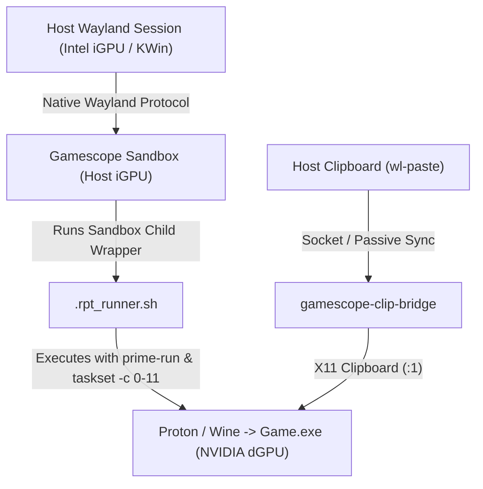

# rpt Architecture & Technical Reference

## 1. Hardware Topology & Wayland Stability

### The KWin Wayland Memory Exhaustion Hazard
On modern hybrid GPU laptops (e.g. Intel Iris Xe + NVIDIA RTX 4060):
1. The desktop compositor (`kwin_wayland`) executes on the Intel integrated graphics (`iris` driver).
2. If Gamescope is launched under `prime-run` or forced to use NVIDIA Vulkan device (`10de:28e0`), Gamescope becomes an NVIDIA client that streams DMA-BUFs into Intel KWin.
3. During Direct3D swapchain recreation (game startup, resolution shifts, DXVK reset), Intel's kernel execution buffer driver runs out of memory:
   ```
   kwin_wayland[PID]: intel: the execbuf ioctl keeps returning ENOMEM
   systemd-coredump: Process 1513 (kwin_wayland) terminated abnormally with signal 6/ABRT
   ```
4. This crashes KDE Plasma instantly, terminating all user applications.

### The Decoupled Gamescope Architecture
`rpt` strictly adheres to the following pipeline:


---

## 2. 2D Utilities vs 3D Game Isolation

Executables are classified into two distinct operational profiles:

### 2D Utilities, Launchers & Installers
- **Signatures**: `*Launcher*.exe`, `*Update*.exe`, `*Setup*.exe`, `*unins*.exe`, `Games.exe`, `*CrashReport*.exe`.
- **Rationale**: Many 2D game launchers and installers are built with Qt 5.15 WebEngine or Chromium Embedded Framework (CEF). When executed with `prime-run` on Wayland sessions, their NVAPI probes trigger glibc `double free or corruption (!prev)` memory corruption.
- **Default Profile**: Host Intel iGPU, Gamescope **OFF**, CPU pinning **OFF**, Power profile **Default**.

### 3D Game Binaries
- **Signatures**: `*Shipping*.exe`, `*Game*.exe`, `Endfield.exe`, or standard game binaries.
- **Default Profile**: NVIDIA RTX 4060 (`prime-run`), Gamescope **ON** (1080p @ 75Hz $\to$ external monitor), CPU pinning **P-Cores (0-11)**, Power profile **Performance**.

---

## 3. Wine Process Isolation & Socket Cleanup

Wine creates IPC server sockets in `/tmp/.wine-<UID>/` using the device and inode numbers of the prefix directory:
`server-<st_dev:x>-<st_ino:x>`

`rpt` manages this lifecycle via `internal/prefix`:
1. **Flock Testing**: Tests `/tmp/.wine-<UID>/server-*/lock` files with non-blocking `flock`. If lock acquisition succeeds, the wineserver process is dead and the directory is safely purged.
2. **Process Pruning**: Inspects `/proc/$pid/environ` for `WINEPREFIX=` before terminating processes, ensuring games running under Steam or Heroic are never touched.

---

## 4. Extensibility Architecture: UMU, Quirks & Cascading Lifecycle Hooks

For "non-standard" games (like *Arknights: Endfield*, HoYoverse games, or repacks with separate installers) that require out-of-the-way runtime hacks, `rpt` implements a **Three-Tier Extensibility Model**:

### Tier 1: Offline UMU & Quirks Detection
- **Local UMU Database**: Parses `umu-database.csv` (1,192 games) bundled inside installed Proton-GE / DW-Proton (`protonfixes/umu-database.csv`).
- **Curated Quirks Registry**: Recognizes titles like Endfield to inject `UMU_ID` (activating upstream IL2CPP `/dev/shm` JIT RAM redirection), `WINE_CANONICAL_HOLE="skip_volatile_check"` (anti-cheat memory hole), and `-vulkan` flags.
- **Explicit Review Modal (`[d]`)**: Presents detected quirks for inspection with a clean diff before applying to `.proton-config.toml`.

### Tier 2: Per-Executable Profiles in Shared Prefix
- A single game directory frequently contains setup utilities (`Setup.exe`), web launchers (`Launcher.exe`), and the 3D binary (`Game.exe`).
- The `profiles` map in `.proton-config.toml` allows each binary to override Gamescope, PrimeRun, P-Cores, and ExtraArgs independently while sharing the identical Wine prefix (`proton-prefix`).
- When switching executables via `[3]`, `rpt` applies the matching profile automatically. In the picker, `[i]` toggles hiding setup/installer binaries.

### Tier 3: Cascading Lifecycle Hooks
Custom shell scripts executed before launch and after exit:
1. Explicit path in `.proton-config.toml` (`pre_launch_hook`, `post_exit_hook`).
2. Local directory: `$PWD/.rpt/hooks/{pre_launch,post_exit}.sh`.
3. User global directory: `$HOME/.config/rpt/hooks/{pre_launch,post_exit}.sh` (or `~/.rpt/hooks/`).

Scripts receive standardized environment variables:
- `$RPT_GAME_DIR`: Root directory of the game.
- `$RPT_PREFIX_DIR`: Absolute path to `proton-prefix`.
- `$RPT_TARGET_EXE`: Target Windows binary.
- `$RPT_PROTON_PATH`: Path to the Proton runner.
- `$RPT_GAMESCOPE_DISPLAY`: Active gamescope display number (e.g. `:1`).
- `$RPT_HOOK_TYPE`: `pre_launch` or `post_exit`.

