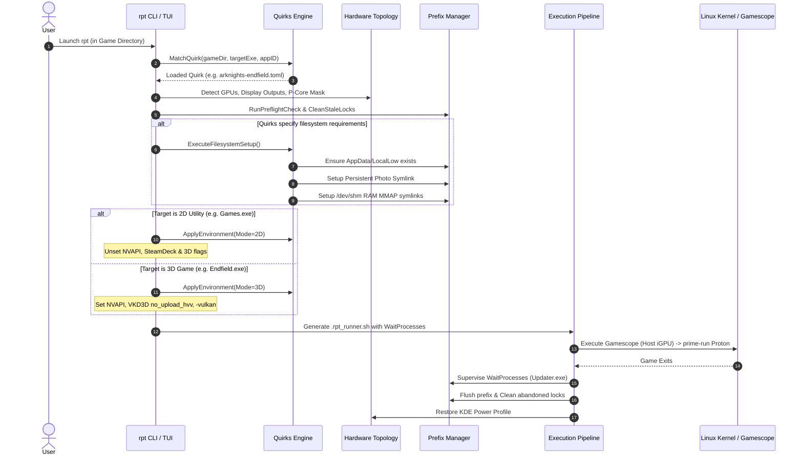

# Arknights: Endfield Engineering Retrospective, Universal Proton Best Practices & Modular Quirks Architecture Specification

> **Document Type:** Architectural Reference & Technical Specification  
> **Target Audience:** Google Antigravity AI Agents, System Engineers, and Linux Game Tooling Developers  
> **Scope:** Analysis of Linux gaming runtime mechanics on modern hybrid hardware (Intel Raptor Lake + NVIDIA Ada Lovelace, CachyOS / Wayland), complete historical documentation of Arknights: Endfield troubleshooting phases, deep-dive into the Wine `ntoskrnl.exe` anti-cheat kernel patches, and an architectural specification for a modular "Per-Game Quirks / Plugin Engine" in generic Proton launchers like `rpt` (`run-proton-tui`).

---

## Table of Contents
1. [Executive Summary & Purpose](#1-executive-summary--purpose)
2. [Chronological Engineering Retrospective (The 7 Phases of Endfield)](#2-chronological-engineering-retrospective-the-7-phases-of-endfield)
   - [Phase 1: August 20, 2026 — The KWin Wayland Desktop Crash (`ENOMEM`)](#phase-1-august-20-2026--the-kwin-wayland-desktop-crash-enomem)
   - [Phase 2: September 7, 2026 — Physical Display Port Routing & The PCIe "Double-Bounce"](#phase-2-september-7-2026--the-pcie-double-bounce)
   - [Phase 3: September 7–8, 2026 — Anti-Cheat Expert (`ACE-BASE.sys`) Stubs & Wrapper Premature Exit](#phase-3-september-78-2026--anti-cheat-expert-ace-basesys-stubs--wrapper-premature-exit)
   - [Phase 4: September 9, 2026 — The `ProbeForWrite` Kernel Driver Crash & `GE-Proton11-6` Resolution](#phase-4-september-9-2026--the-probeforwrite-kernel-driver-crash--ge-proton11-6-resolution)
   - [Phase 5: September 13, 2026 — Inter-Game Contention, `/dev/ntsync` Collisions & `xalia.exe` Injection](#phase-5-september-13-2026--inter-game-contention-devntsync-collisions--xaliaexe-injection)
   - [Phase 6: September 15, 2026 — 2D Desktop Launcher Mode vs 3D Game Mode & Qt5 NVAPI Double-Free Crash](#phase-6-september-15-2026--2d-desktop-launcher-mode-vs-3d-game-mode--qt5-nvapi-double-free-crash)
   - [Phase 7: September 16, 2026 — Cross-Compositor Clipboard Vacuum & Gamescope Bridge Daemon](#phase-7-september-16-2026--cross-compositor-clipboard-vacuum--gamescope-bridge-daemon)
3. [Taxonomy Matrix: Universal Best Practices vs Hardware/Wayland Realities vs Bespoke Quirks](#3-taxonomy-matrix-universal-best-practices-vs-hardwarewayland-realities-vs-bespoke-quirks)
   - [Category A: Universal Proton / Wine Best Practices (All Games)](#category-a-universal-proton--wine-best-practices-all-games)
   - [Category B: Hybrid Hardware & Wayland Topology Realities (All Hybrid Laptops)](#category-b-hybrid-hardware--wayland-topology-realities-all-hybrid-laptops)
   - [Category C: Bespoke Arknights: Endfield Engine & Anti-Cheat Quirks](#category-c-bespoke-arknights-endfield-engine--anti-cheat-quirks)
4. [Deep Dive: The Wine `ntoskrnl.exe` Anti-Cheat Binary Patch](#4-deep-dive-the-wine-ntoskrnlexe-anti-cheat-binary-patch)
   - [Root Cause in Wine Kernel Emulation](#root-cause-in-wine-kernel-emulation)
   - [Why Wine 10 (`dwproton-10.0-26`) Fails: The Dummy `ProbeForWrite` Trap](#why-wine-10-dwproton-100-26-fails-the-dummy-probeforwrite-trap)
   - [Why `GE-Proton11-6` Succeeds with Patches](#why-ge-proton11-6-succeeds-with-patches)
   - [Exact Binary Patch Specification & Byte Offsets](#exact-binary-patch-specification--byte-offsets)
   - [Why Upstream Has Not Merged It](#why-upstream-has-not-merged-it)
   - [Automated Python Reapplication & Verification Utility](#automated-python-reapplication--verification-utility)
5. [Evaluation of `run-proton-tui` (`rpt`) Against Endfield Requirements](#5-evaluation-of-run-proton-tui-rpt-against-endfield-requirements)
   - [What `rpt` Already Handles Flawlessly](#what-rpt-already-handles-flawlessly)
   - [The 6 Critical Blindspots in `rpt`](#the-6-critical-blindspots-in-rpt)
6. [Architectural Specification: Modular Per-Game Quirks / Plugin Engine](#6-architectural-specification-modular-per-game-quirks--plugin-engine)
   - [Design Philosophy: Decoupled Core vs Declarative Quirks](#design-philosophy-decoupled-core-vs-declarative-quirks)
   - [Quirks Manifest Specification (`.toml`)](#quirks-manifest-specification-toml)
   - [Quirks Execution Lifecycle in the Runner Pipeline](#quirks-execution-lifecycle-in-the-runner-pipeline)
   - [Reference Manifest: `arknights-endfield.toml`](#reference-manifest-arknights-endfieldtoml)

---

## 1. Executive Summary & Purpose

Over the course of August and September 2026, launching and sustaining **Arknights: Endfield** on CachyOS (Linux Kernel 7.2.x, KDE Plasma 6.x Wayland, ASUS TUF Gaming F15 with Intel Core i7-13620H and NVIDIA RTX 4060 Mobile) required diagnosing and solving layers of complex interactions between:
- The Linux kernel memory allocator and DRM subsystem,
- KDE Plasma's Wayland compositor (`kwin_wayland`),
- Valve's nested micro-compositor (`gamescope`),
- NVIDIA Prime render offloading (`__NV_PRIME_RENDER_OFFLOAD=1`),
- Wine's NT kernel emulation subsystem (`winedevice.exe`, `ntoskrnl.exe`),
- Tencent Anti-Cheat Expert (`ACE-BASE.sys`),
- Unity IL2CPP JIT compilation memory-mapping (`HG_IL2CPP_MMAP0..63`), and
- Chromium / Qt5 WebEngine NVAPI probing deadlocks (`double free or corruption`).

When building generic Proton game launchers (such as **`rpt` / `run-proton-tui`**), developers frequently face a dilemma:
> *Which of these fixes belong in the core launcher as universal best practices for every Windows game, which belong to the physical hardware/Wayland layer, and which should be isolated into modular game-specific plugins or quirks?*

This document provides the definitive technical record to answer that question. It serves as an interoperable knowledge base that any instance of Antigravity or Antigravity IDE can consume to guide refactors, add game support, and prevent architectural regressions.

---

## 2. Chronological Engineering Retrospective (The 7 Phases of Endfield)

### Phase 1: August 20, 2026 — The KWin Wayland Desktop Crash (`ENOMEM`)
* **Symptom:** Running `prime-run gamescope ... ./Endfield.exe` crashed the entire KDE Plasma desktop session back to SDDM within 1–2 seconds. All open desktop applications were killed.
* **Investigation:** 
  Inspecting `journalctl -b -1` and `coredumpctl` revealed:
  ```text
  kwin_wayland[1513]: intel: the execbuf ioctl keeps returning ENOMEM
  systemd-coredump[1620]: Process 1513 (kwin_wayland) terminated abnormally with signal 6/ABRT
  ```
* **Root Cause:**
  1. The host desktop compositor (`kwin_wayland`) runs on the Intel Raptor Lake integrated GPU (`iris` / `libgallium`).
  2. Putting `prime-run` in front of `gamescope` forces the Gamescope Wayland/Vulkan process itself to initialize as an NVIDIA client.
  3. Gamescope continuously submits rendered framebuffers across the PCIe bus as DMA-BUFs directly into Intel's KWin compositor.
  4. When games initialize DXVK/VKD3D or create swapchains, the sudden buffer allocations exhaust the Intel kernel GEM execution buffer pool (`ENOMEM`). KWin aborts with SIGABRT.
* **Engineering Fix Applied:**
  **Decoupled Gamescope Architecture**:
  - Gamescope **MUST** run as an unprivileged, standard Wayland client on the host compositor (Intel iGPU).
  - `prime-run` **MUST** be placed *inside* the Gamescope sandbox, executing strictly on the Windows game binary (`Endfield.exe`).
  - Command shape:
    ```bash
    # CORRECT: Gamescope on Intel iGPU, prime-run inside sandbox
    gamescope [args] -- /bin/bash -c "prime-run proton waitforexitandrun ./Endfield.exe"
    ```

---

### Phase 2: September 7, 2026 — Physical Display Port Routing & The PCIe "Double-Bounce"
* **Symptom:** Forcing `--prefer-vk-device 8086:a7a8` (Intel iGPU) on Gamescope caused severe framerate stuttering and 100% PCIe bus saturation when playing on the external 1080p monitor.
* **Investigation:**
  Inspecting `/sys/class/drm/` revealed the physical wiring topology of the ASUS TUF Gaming F15:
  ```text
  card2 (Intel iGPU):
    └── card2-eDP-1    --> Laptop Internal Screen (1920x1080 @ 144Hz, Scaling 1.25x)
  card1 (NVIDIA RTX 4060 dGPU):
    ├── card1-HDMI-A-1 --> External Primary Gaming Monitor (1920x1080 @ 75Hz, Scaling 1.0x)
    └── card1-DP-3     --> External Secondary Display (Connected)
  ```
* **Root Cause:**
  The external HDMI port is hardwired directly to the NVIDIA dGPU (`card1`), while the laptop internal screen is wired to the Intel iGPU (`card2`).
  When `--prefer-vk-device 8086:a7a8` was forced:
  $$\text{Game (NVIDIA dGPU)} \xrightarrow{\text{PCIe}} \text{Gamescope (Intel iGPU)} \xrightarrow{\text{PCIe}} \text{Monitor Output (NVIDIA HDMI-A-1)}$$
  Frames were copied back and forth across the PCIe bus twice ("double-bounce"), causing massive latency and bus congestion.
* **Engineering Fix Applied:**
  1. Removed `--prefer-vk-device 8086:a7a8` from Gamescope. Gamescope defaults naturally to the host compositor's Vulkan device without being forced.
  2. Explicitly added `--prefer-output HDMI-A-1 -r 75` to Gamescope so it targets the hardwired external display at its native refresh rate.

---

### Phase 3: September 7–8, 2026 — Anti-Cheat Expert (`ACE-BASE.sys`) Stubs & Wrapper Premature Exit
* **Symptom A:** Community launchers (e.g., LLauncher) crashed the desktop because they ran without Gamescope decoupling.
* **Symptom B:** Testing `dwproton-10.0-26` resulted in an immediate crash during driver initialization:
  ```text
  wine: Call from 0x7b012345 to unimplemented function ntoskrnl.exe.PsGetProcessExitStatus, aborting
  wine: Call from 0x7b012345 to unimplemented function ntoskrnl.exe.SeQueryInformationToken, aborting
  ```
* **Symptom C:** Passing absolute path `Z:$TARGET_EXE` with default `UMU_USE_STEAM=1` caused Gamescope to close within 0.5 seconds with exit code 0.
* **Root Causes:**
  1. Tencent Anti-Cheat Expert (`ACE-BASE.sys`) operates in kernel space via Wine's `winedevice.exe`. It calls Windows NT kernel functions that Wine left as unimplemented stubs. In Wine, calling an unimplemented stub raises `RaiseException(STATUS_WINE_STUB, EXCEPTION_NONCONTINUABLE)`. Because it is non-continuable, `winedevice.exe` dies instantly, killing the game.
  2. Passing absolute Windows paths to Proton's python wrapper when `UMU_USE_STEAM=1` causes the wrapper to delegate the command to `steam.exe`. Under a non-Steam prefix, `steam.exe` logs that Steam is not running and exits with code 0 immediately.
* **Engineering Fixes Applied:**
  1. Binary-patched `ntoskrnl.exe` in `dwproton-10.0-26` at offsets `0x4420` and `0x5110` with `xor %eax, %eax; ret;` (`31 c0 c3` + NOPs).
  2. Enforced relative executable invocation:
     `cd "$TARGET_DIR" && "$PROTON_BIN" waitforexitandrun ./"$EXE_NAME"`.
  3. Enforced `UMU_USE_STEAM=0` in the environment so Proton executes the binary directly via Wineserver instead of handing off to Steam.

---

### Phase 4: September 9, 2026 — The `ProbeForWrite` Kernel Driver Crash & `GE-Proton11-6` Resolution
* **Symptom:** With `dwproton-10.0-26`, DXVK initialized and the game opened, but Gamescope closed abruptly after exactly 9 seconds.
* **Investigation:**
  Wine kernel debug logging (`WINEDEBUG="+relay,+seh,+ntoskrnl"`) revealed an unhandled page fault inside `winedevice.exe`:
  ```text
  01d0:trace:seh:raise_exception code=c0000005 flags=0 addr=0x7ffb123456 ip=ace-base.sys+0x9f515
  ace-base.sys+0x9f515: movl %edi, (%rsi)   <-- Access violation writing to invalid address
  ```
* **Root Cause:**
  In Wine 10 (`dwproton-10.0-26`), `ProbeForWrite` in `ntoskrnl.exe` was implemented as a dummy no-op stub:
  ```c
  void WINAPI ProbeForWrite(void *Address, SIZE_T Length, ULONG Alignment) {
      /* Dummy stub: does nothing, returns success */
  }
  ```
  Kernel drivers (like Tencent Anti-Cheat) test unmapped memory addresses using `ProbeForWrite` inside a `__try/__except` block. They expect the kernel to probe the memory and raise `STATUS_ACCESS_VIOLATION` if the address is invalid.
  Because Wine 10's stub silently succeeded, ACE concluded the memory was valid and executed `movl %edi, (%rsi)`, crashing the entire anti-cheat service thread.
* **The Transition to `GE-Proton11-6` (Wine 11):**
  Upstream Wine 11 rewritten kernel memory validation (`virtual_check_buffer_for_write`), correctly raising access violations for `ProbeForWrite`. Furthermore, `GE-Proton11-6` has native support for `PsGetProcessExitStatus`.
  However, `GE-Proton11-6` initially halted on two different unhandled stubs:
  1. `SeQueryInformationToken` (offset `0x4f90`): Raised `STATUS_WINE_STUB`.
  2. `PsGetProcessExitProcessCalled` (offset `0x43a8`): Raised `STATUS_WINE_STUB`.
* **Engineering Fix Applied:**
  Binary-patched `ntoskrnl.exe` in `GE-Proton11-6`:
  - `SeQueryInformationToken` patched to return `STATUS_NOT_IMPLEMENTED` (`0xc0000002`: `b8 02 00 00 c0 c3` + NOPs). This informs the driver that token queries are unsupported, triggering ACE's clean internal fallback.
  - `PsGetProcessExitProcessCalled` patched to return `FALSE` (`0`: `31 c0 c3` + NOPs).
  *(See [Section 4](#4-deep-dive-the-wine-ntoskrnlexe-anti-cheat-binary-patch) for full byte specifications).*

---

### Phase 5: September 13, 2026 — Inter-Game Contention, `/dev/ntsync` Collisions & `xalia.exe` Injection
* **Symptom:** Launching Endfield immediately after closing a Steam game (e.g., *Balatro* running on `CachyOS-11.0-100`) caused Endfield to crash within 5–6 seconds during DXVK swapchain initialization.
* **Root Causes:**
  1. **Kernel NT Sync Descriptor Clashes:** Linux 6.13+ and CachyOS use `/dev/ntsync` for fast in-kernel synchronization. When a previous Proton game terminates, if any helper process or wineserver remains in teardown, stale lock directories in `/tmp/.wine-<UID>/server-*/` and active ntsync device descriptors cause the new prefix to fail swapchain creation.
  2. **`xalia.exe` UI Automation Hooking:** Proton 11 by default launches `xalia.exe` (accessibility UI automation). Inside Gamescope, `xalia.exe` created a competing DXVK swapchain right as Endfield was transitioning from DXVK to VKD3D, triggering a race condition and tripping the anti-cheat driver.
* **Engineering Fixes Applied:**
  1. **Disabled Xalia:** Injected `PROTON_USE_XALIA=0` into the environment.
  2. **Non-Blocking Lock Sweep:** Added `action_clean_stale_locks` using non-blocking `flock(LOCK_EX | LOCK_NB)` on all `/tmp/.wine-<UID>/server-*/lock` files. If flock succeeds, the server is dead and the abandoned directory is purged.
  3. **Active Conflict Detection:** Added scanning of `/proc` for foreign Wine processes, giving the user a prompt to kill conflicting games before launching.

---

### Phase 6: September 15, 2026 — 2D Desktop Launcher Mode vs 3D Game Mode & Qt5 NVAPI Double-Free Crash
* **Symptom:** Launching the GRYPHLINK official launcher (`Games.exe` / `Launcher.exe`) natively on the desktop without Gamescope triggered:
  ```text
  double free or corruption (!prev)
  pthread_kill + 299
  ```
  glibc aborted the process, worker thread `ThreadPoolBackg` spun at 100% CPU in an infinite deadlock, an unresponsive notification tray icon appeared, and no launcher window rendered.
* **Investigation:**
  Backtracing the core dump revealed:
  1. `Games.exe` is a 2D desktop application built on Qt 5.15 and Chromium WebEngine (`Qt5WebEngineCore.dll`).
  2. When executed with `prime-run` (`__NV_PRIME_RENDER_OFFLOAD=1`, `__GLX_VENDOR_LIBRARY_NAME=nvidia`) or when `PROTON_ENABLE_NVAPI=1` is set, Chromium attempts to probe GPU configuration via NVAPI.
  3. NVAPI probing on KWin Wayland returned malformed JSON (`{"code":5, "data":}`).
  4. Chromium's cleanup handler failed during JSON parser destruction, triggering memory corruption in `free()`.
* **Symptom B (Child Updater Truncation):**
  When clicking "Update" inside `Games.exe`, `Games.exe` spawns `Updater.exe` (or `7zg.exe`, `Patch.exe`) and exits immediately so its own binary can be overwritten.
  Because `waitforexitandrun ./Games.exe` returned upon `Games.exe`'s exit, the launcher script immediately proceeded to prefix flush, killing `Updater.exe` ~450KB into downloading `updater_tmp`.
* **Engineering Fixes Applied:**
  1. **Dual-Mode Separation (Launcher vs Game):**
     - When target is `Games.exe` or `Launcher.exe`, `prime-run` is **omitted entirely**, running natively on the host Intel Iris Xe iGPU.
     - 3D/NVIDIA flags are **unset**: `PROTON_ENABLE_NVAPI`, `DXVK_ENABLE_NVAPI`, `PROTON_ENABLE_NGX_UPDATER`, `VKD3D_CONFIG`.
     - Steam Deck flags are **unset**: `STEAMOS`, `STEAMDECK` (preventing Chromium from altering viewport boundaries).
  2. **Child Process Supervision:**
     Added a process wait loop in the runner script to supervise `(Updater|7zg|Patch)\.exe` and any relaunched `(Games|Launcher)\.exe` before flushing the prefix.

---

### Phase 7: September 16, 2026 — Cross-Compositor Clipboard Vacuum & Gamescope Bridge Daemon
* **Symptom:** Copying promo codes, redemption links, or account keys on the host desktop (e.g., from a browser or Discord) failed to paste (`Ctrl+V`) into Arknights: Endfield when running inside Gamescope.
* **Root Cause:**
  Gamescope is an isolated nested Wayland/X11 micro-compositor. By design, Gamescope does not bridge clipboard selections between the host compositor (KDE Plasma `wayland-0` / `DISPLAY=:0`) and its nested Xwayland server (`DISPLAY=:1`).
  When the user presses `Ctrl+V` in Endfield, Wine queries `DISPLAY=:1`'s X11 clipboard. Because nothing owns the `CLIPBOARD` atom on `:1`, Wine sees an empty clipboard.
  Furthermore, certain custom in-game input boxes intercept or ignore raw `Ctrl+V` key events, requiring simulated character-by-character typing.
* **Engineering Fixes Applied:**
  1. **`gamescope-clip-bridge` Daemon:** Developed a lightweight C binary linked against `libX11`. It monitors the host Wayland clipboard via `wl-paste -n --watch` and immediately asserts ownership of `CLIPBOARD` and `PRIMARY` on Gamescope's nested display (`DISPLAY=:1`). It handles `TARGETS`, `UTF8_STRING`, `STRING`, and `TEXT` requests from Wine.
  2. **Lifecycle Autostart:** The launcher exports the display number (`echo "$DISPLAY" > /tmp/gamescope-endfield-display`) and starts `gamescope-clip-bridge` in the background, terminating it cleanly on game exit.
  3. **Auto-Typer Utility (`clip-push-endfield`):** Created a helper script (`endfield-type`) that uses `xdotool type --delay 15` on Gamescope's display to simulate typing for input fields where paste is blocked by game engine code.

---

## 3. Taxonomy Matrix: Universal Best Practices vs Hardware/Wayland Realities vs Bespoke Quirks

To build a modular launcher like `rpt`, we must categorize every mechanism from the Endfield experience into its appropriate architectural layer:

```
┌────────────────────────────────────────────────────────────────────────┐
│                      MODULAR RUNTIME ARCHITECTURE                      │
├────────────────────────────────────────────────────────────────────────┤
│  CATEGORY C: Bespoke Game Quirks & Anti-Cheat Plugins                  │
│  (UMU Fixes, Memory Holes, JIT MMAP RAM, ntoskrnl Patches, Steam ID)   │
├────────────────────────────────────────────────────────────────────────┤
│  CATEGORY B: Hardware Topology & Wayland Compositor Layer              │
│  (Decoupled Gamescope, Output Routing, P-Core Pinning, 2D/3D Split)    │
├────────────────────────────────────────────────────────────────────────┤
│  CATEGORY A: Universal Proton / Wine Core Runtime Engine               │
│  (Prefix Hygiene, Lock Sweeper, Save Preservation, Process Isolation)  │
└────────────────────────────────────────────────────────────────────────┘
```

### Category A: Universal Proton / Wine Best Practices (All Games)
These mechanisms apply to **any** standalone or Steam game running under Proton:

1. **Prefix Process Isolation & Safe Flush:**
   - Never use blanket `pkill -f winedevice.exe` or `pkill -f explorer.exe`.
   - Inspect `/proc/$pid/environ` for `WINEPREFIX=` to target only processes belonging to the specific game.
   - Always shut down wineserver gracefully using `wineserver -k` followed by `wineserver -w`.
2. **Stale Lock Cleanup via Non-Blocking Flock:**
   - When Proton crashes, `/tmp/.wine-<UID>/server-*/` sockets are often orphaned.
   - Test `/tmp/.wine-<UID>/server-*/lock` with `flock(LOCK_EX | LOCK_NB)`. If lock succeeds, the wineserver is dead and the folder can be purged safely. Active games will reject the lock.
3. **Save Game & User Data Preservation:**
   - Never wipe a prefix without automatically backing up user directories.
   - Standard locations: `Saved Games`, `Documents`, `AppData/Local`, `AppData/Roaming`, and **`Pictures`** (often overlooked, leading to screenshot loss).
4. **Prefix Containment Guardrails:**
   - Detect if the game installation directory or executable is located inside `drive_c/` of the prefix. Block prefix wipes if containment is detected to prevent deleting the game files.
5. **Proton Logging AppID Requirement:**
   - Setting `PROTON_LOG=1` is ignored by Proton's internal Python runner unless both `STEAM_COMPAT_APP_ID` and `SteamGameId` are set in the environment.
6. **Suppression of Steam Overlays on Standalone Titles:**
   - Set `DISABLE_VK_LAYER_VALVE_steam_overlay_1=1` and `DISABLE_VK_LAYER_VALVE_steam_fossilize_1=1` to eliminate Vulkan layer overhead and hook crashes on non-Steam titles.
7. **Disable Xalia Accessibility UI Automation:**
   - Set `PROTON_USE_XALIA=0` by default. `xalia.exe` creates unwanted competing DXVK swapchains and trips anti-cheat hooks.
8. **Kernel NT Synchronization (`ntsync`):**
   - Dynamically check if `/dev/ntsync` exists in `/dev/`. If present, set `PROTON_USE_NTSYNC=1`; otherwise set `PROTON_NO_NTSYNC=1`.
9. **Relative Invocation & Steam Wrapper Bypass:**
   - Always run `cd "$EXE_DIR"` and invoke `./"$EXE_NAME"` with `UMU_USE_STEAM=0`. Absolute Windows paths trigger `steam.exe` delegation which exits prematurely.

---

### Category B: Hybrid Hardware & Wayland Topology Realities (All Hybrid Laptops)
These rules apply to any Linux system running modern hybrid graphics (Intel/AMD iGPU + NVIDIA dGPU) on Wayland compositors:

1. **Decoupled Gamescope Architecture:**
   - **Rule:** Gamescope **MUST** run on the host compositor's GPU (the iGPU driving KWin).
   - **Rule:** `prime-run` **MUST** be placed inside the Gamescope wrapper script executing only the 3D game.
   - **Hazard:** Running `prime-run gamescope` causes KWin Wayland to crash with `execbuf ENOMEM`.
2. **Physical DRM Port Routing:**
   - Query `/sys/class/drm/card*-*/status` to identify connected external outputs.
   - Prioritize external ports (`HDMI-A-1`, `DP-*`) which are typically hardwired to the dGPU, passing `--prefer-output <CONNECTOR>` to Gamescope.
3. **Intel Hybrid CPU Core Pinning (P-Cores vs E-Cores):**
   - On Intel 12th/13th/14th Gen processors, query `/sys/devices/cpu_core/cpus` to discover Performance core threads (e.g., `0-11`).
   - Pin 3D games using `taskset -c 0-11` to eliminate micro-stutter caused by thread migration to Gracemont Efficiency cores.
4. **2D Desktop Utility vs 3D Game Engine Decoupling:**
   - Executables classified as 2D utilities, setup installers, or web launchers (Qt5 WebEngine, CEF) must:
     - Run on host iGPU (`prime-run` omitted).
     - Have 3D/NVIDIA variables **unset**: `PROTON_ENABLE_NVAPI`, `DXVK_ENABLE_NVAPI`, `PROTON_ENABLE_NGX_UPDATER`, `VKD3D_CONFIG`.
     - Have Steam Deck variables **unset**: `STEAMOS`, `STEAMDECK`.
     - Run with Gamescope **disabled**.
5. **Cross-Compositor Clipboard Synchronization:**
   - Gamescope does not bridge the host Wayland clipboard (`wayland-0`) to its nested Xwayland server (`:1`).
   - Any launcher utilizing Gamescope must provide a clipboard bridge daemon to monitor `wl-paste` and own `CLIPBOARD` on Gamescope's `$DISPLAY`.

---

### Category C: Bespoke Arknights: Endfield Engine & Anti-Cheat Quirks
These requirements are unique to **Arknights: Endfield** (and related Tencent / Gryphline titles):

1. **Anti-Cheat Memory Hole:**
   - Tencent Anti-Cheat Expert (`ACE-BASE.sys`) fails during memory integrity verification unless Wine bypasses volatile page validation.
   - Required environment variable: `WINE_CANONICAL_HOLE="skip_volatile_check"`.
2. **Unity IL2CPP JIT RAM MMAP Acceleration:**
   - Endfield writes large bursts of JIT worker code to `drive_c/users/steamuser/AppData/LocalLow/HG_IL2CPP_MMAP0..63`.
   - To prevent disk I/O bottlenecks and loading stalls, all 64 files must be symlinked into `/dev/shm/` (RAM).
   - *Requirement:* The folder `drive_c/users/steamuser/AppData/LocalLow` must be created if it does not exist before symlinks are established.
3. **DirectX to Vulkan Argument:**
   - Endfield's Unity engine must be instructed to run via Vulkan: `-vulkan`.
4. **Updater Handoff Process Supervision:**
   - When updating, `Games.exe` delegates to `Updater.exe`, `7zg.exe`, or `Patch.exe` and terminates. The runner must wait for these processes to complete before executing prefix flush.
5. **Display Registration for External Auto-Typing:**
   - Export `$DISPLAY` to `/tmp/gamescope-endfield-display` so external auto-typers (`clip-push-endfield`) can locate the active nested Xwayland window.
6. **Persistent In-Game Screenshot Linking:**
   - Photos captured using the in-game camera are saved to `drive_c/users/steamuser/Pictures/ENDFIELD`.
   - Must be symlinked to the host directory `~/Pictures/ENDFIELD`, and protected during prefix wipes.
7. **Wine Kernel `ntoskrnl.exe` Binary Patches:**
   - Anti-Cheat Expert requires `GE-Proton11-6` with binary patches to `ntoskrnl.exe` for `PsGetProcessExitProcessCalled` and `SeQueryInformationToken`.

---

## 4. Deep Dive: The Wine `ntoskrnl.exe` Anti-Cheat Binary Patch

### Root Cause in Wine Kernel Emulation
When Arknights: Endfield boots, Tencent Anti-Cheat Expert (`ACE-BASE.sys`) is loaded into Wine's kernel driver space by `winedevice.exe`. ACE performs low-level operating system inspection by calling internal Windows NT kernel APIs exported by `ntoskrnl.exe`.

In standard upstream Wine, functions that have not yet been implemented contain a stub that calls:
```c
wine_dbg_log(HDEL_WARN, "Call from %p to unimplemented function ntoskrnl.exe.%s, aborting\n", ...);
RtlRaiseException(STATUS_WINE_STUB);
```
`STATUS_WINE_STUB` (`0x80000100`) is marked as `EXCEPTION_NONCONTINUABLE`. When raised inside a kernel service like `winedevice.exe`, the thread aborts immediately. The anti-cheat service dies, and `Endfield.exe` terminates within 9 seconds.

---

### Why Wine 10 (`dwproton-10.0-26`) Fails: The Dummy `ProbeForWrite` Trap
Early experiments utilized `dwproton-10.0-26` with patched `PsGetProcessExitStatus` and `SeQueryInformationToken` stubs. However, the game consistently crashed after 9 seconds due to an access violation at `ace-base.sys + 0x9f515`.

* **The Mechanism:**
  ```text
  User space buffer test:
  ACE-BASE.sys calls ProbeForWrite(UnmappedBuffer, Size, Alignment) inside __try block.
  ```
  In Wine 10, `ProbeForWrite` was an empty no-op:
  ```c
  void WINAPI ProbeForWrite(void *Address, SIZE_T Length, ULONG Alignment) {
      return; /* No check performed! */
  }
  ```
  ACE expects the kernel to validate the pointer and raise `STATUS_ACCESS_VIOLATION` if unmapped, allowing ACE's `__except` handler to catch it. Because Wine 10 returned success, ACE proceeded to execute `movl %edi, (%rsi)` against unmapped memory, resulting in an uncatchable segmentation fault.

---

### Why `GE-Proton11-6` Succeeds with Patches
`GE-Proton11-6` is based on Wine 11. Wine 11 overhauled kernel memory probing:
- `ProbeForWrite` and `ProbeForRead` now call `virtual_check_buffer_for_write()`, which properly probes page tables and raises `STATUS_ACCESS_VIOLATION` on invalid pointers.
- Upstream implemented native handling for `PsGetProcessExitStatus`.
- It includes upstream UMU gamefixes for `umu-endfield`.

`GE-Proton11-6` only halts on two specific missing kernel stubs:
1. `PsGetProcessExitProcessCalled`: ACE queries whether process termination has already begun.
2. `SeQueryInformationToken`: ACE inspects security token attributes.

---

### Exact Binary Patch Specification & Byte Offsets

* **Target Binary:** `~/.local/share/Steam/compatibilitytools.d/GE-Proton11-6/files/lib/wine/x86_64-windows/ntoskrnl.exe`
* **File Size:** Exactly `839,680` bytes.

#### 1. `PsGetProcessExitProcessCalled`
* **File Offset:** `0x43a8`
* **Length:** 24 bytes
* **Original Byte Sequence (Wine Stub):**
  ```hex
  48 83 ec 28 48 8d 0d 50 7b 02 00 48 8d 15 7a 92 02 00 e8 43 c0 01 00 90
  ```
  *(Sets up stack frame, prints stub warning, calls `RtlRaiseException(STATUS_WINE_STUB)`)*.
* **Replacement Byte Sequence:**
  ```hex
  31 c0 c3 90 90 90 90 90 90 90 90 90 90 90 90 90 90 90 90 90 90 90 90 90
  ```
* **Disassembly:**
  ```assembly
  xor %eax, %eax    ; Set return value (EAX) to 0 (FALSE)
  ret               ; Return immediately
  nop               ; 21 NOP instructions to preserve function alignment
  ```
* **Behavioral Effect:** Informs the driver that the process has not terminated. Driver continues normally.

---

#### 2. `SeQueryInformationToken`
* **File Offset:** `0x4f90`
* **Length:** 24 bytes
* **Original Byte Sequence (Wine Stub):**
  ```hex
  48 83 ec 28 48 8d 0d 71 72 02 00 48 8d 15 92 86 02 00 e8 5b c4 01 00 90
  ```
* **Replacement Byte Sequence:**
  ```hex
  b8 02 00 00 c0 c3 90 90 90 90 90 90 90 90 90 90 90 90 90 90 90 90 90 90
  ```
* **Disassembly:**
  ```assembly
  mov $0xc0000002, %eax  ; Set return value to STATUS_NOT_IMPLEMENTED
  ret                    ; Return immediately
  nop                    ; 18 NOP instructions
  ```
* **Behavioral Effect:** 
  In the ACE driver disassembly:
  ```assembly
  call SeQueryInformationToken
  test %eax, %eax
  js handle_unsupported_token_path
  ```
  Returning `STATUS_NOT_IMPLEMENTED` (`0xc0000002`, where the sign bit is set) triggers the driver's internal branch for older Windows kernels where token query APIs were absent, cleanly bypassing the check.

---

### Why Upstream Has Not Merged It
1. **Wine Architecture Policy:** Wine developers reject patches that stub security functions with dummy return codes without full implementation of underlying NT token objects.
2. **Anti-Cheat Fragility:** Community Proton distributions (like GloriousEggroll) avoid maintaining game-specific binary patches in `ntoskrnl.exe` because anti-cheat updates frequently change the function call graph or add new checks.
3. **Forum Stagnation:** Reports posted to community compatibility forums often lack assembly-level call stack analysis, leading to issues being classified generically as "anti-cheat unsupported."

---

### Automated Python Reapplication & Verification Utility

Whenever `GE-Proton11-6` is reinstalled or updated, run this script to inspect or patch the binary:

```python
#!/usr/bin/env python3
"""
GE-Proton11-6 ntoskrnl.exe Binary Patcher for Tencent Anti-Cheat Expert
Location: ~/bin/patch-proton-endfield.py
"""
import os
import shutil
import sys

TARGET = {
    "name": "GE-Proton11-6",
    "path": os.path.expanduser("~/.local/share/Steam/compatibilitytools.d/GE-Proton11-6/files/lib/wine/x86_64-windows/ntoskrnl.exe"),
    "expected_size": 839680,
    "patches": {
        "PsGetProcessExitProcessCalled": (0x43a8, bytes.fromhex("31c0c3" + "90" * 21)),
        "SeQueryInformationToken": (0x4f90, bytes.fromhex("b8020000c0c3" + "90" * 18)),
    }
}

path = TARGET["path"]
if not os.path.exists(path):
    print(f"[-] Target binary not found: {path}")
    sys.exit(1)

file_size = os.path.getsize(path)
if file_size != TARGET["expected_size"]:
    print(f"[!] Warning: File size ({file_size}) differs from expected ({TARGET['expected_size']}). Offsets may have shifted!")

# Create clean backup if not present
backup_path = path + ".orig"
if not os.path.exists(backup_path):
    shutil.copy2(path, backup_path)
    print(f"[+] Created clean backup: {backup_path}")

with open(path, "r+b") as f:
    data = bytearray(f.read())
    modified = False

    for func_name, (offset, payload) in TARGET["patches"].items():
        current = data[offset:offset+len(payload)]
        if current == payload:
            print(f"[=] {func_name} is already PATCHED at 0x{offset:x}")
        else:
            print(f"[!] Patching {func_name} at 0x{offset:x}...")
            data[offset:offset+len(payload)] = payload
            modified = True

    if modified:
        f.seek(0)
        f.write(data)
        f.truncate()
        print("[✓] Successfully applied kernel patches to GE-Proton11-6!")
    else:
        print("[✓] Binary is in verified working state.")
```

---

## 5. Evaluation of `run-proton-tui` (`rpt`) Against Endfield Requirements

Comparing the implementation of `rpt` against `play-endfield.fish`:

### What `rpt` Already Handles Flawlessly
1. **Decoupled Gamescope Sandboxing:** `rpt` runs Gamescope on the host iGPU without `prime-run`, placing `prime-run` inside `.rpt_runner.sh`.
2. **Display Connector Routing:** Detects connected outputs via sysfs and defaults to `HDMI-A-1` at 1080p@75Hz.
3. **Cross-Compositor Clipboard Bridge:** Launches `~/bin/gamescope-clip-bridge` and exports display to `/tmp/gamescope-endfield-display`.
4. **CPU Topology Pinning:** Pins P-cores `0-11` via `taskset -c 0-11`.
5. **Fast NT Synchronization:** Automatically checks for `/dev/ntsync` and sets `PROTON_USE_NTSYNC=1`.
6. **Child Updater Supervision:** Supervises `Updater.exe`, `7zg.exe`, `Patch.exe`, and `Games.exe` before teardown.
7. **Relative Invocation & Steam Bypass:** Runs relative `./$EXE_NAME` with `UMU_USE_STEAM=0`.

---

### The 6 Critical Blindspots in `rpt`

#### 1. Hazard 1: Qt5 WebEngine NVAPI Memory Corruption in Launcher Mode (Fatal Crash)
* **Problem:** In [`internal/proton/environment.go`](internal/proton/environment.go), `BuildEnvironment()` injects `PROTON_ENABLE_NVAPI=1`, `DXVK_ENABLE_NVAPI=1`, `STEAMOS=1`, and `STEAMDECK=1` **unconditionally for all binaries**.
* **Effect:** Even when `Games.exe` is selected with `UsePrimeRun: false`, these flags remain active. Qt5 WebEngine probes NVAPI, fails during cleanup, and crashes with glibc `double free or corruption (!prev)`.
* **Required Fix:** When `UsePrimeRun` is false or the binary is classified as `ExeType2DUtility`, strip `PROTON_ENABLE_NVAPI`, `DXVK_ENABLE_NVAPI`, `PROTON_ENABLE_NGX_UPDATER`, `VKD3D_CONFIG`, `STEAMOS`, and `STEAMDECK` from the environment.

#### 2. Hazard 2: Screenshot Deletion on Prefix Clean (Permanent Data Loss)
* **Problem:** In [`internal/prefix/backup.go`](internal/prefix/backup.go), `BackupSaves` only archives:
  `Saved Games`, `Documents`, `AppData/Local`, `AppData/Roaming`.
* **Effect:** In-game screenshots saved to `drive_c/users/steamuser/Pictures/ENDFIELD` are never backed up. Running `rpt --clean` or pressing `[c]` in `rpt` permanently destroys all user screenshots.
* **Required Fix:** Add `"Pictures"` to `savePaths` in `backup.go`, and add a pre-launch check to symlink `Pictures/ENDFIELD` to `~/Pictures/ENDFIELD`.

#### 3. Hazard 3: Subfolder Profile Matching Bug
* **Problem:** In `GRYPHLINK`, binaries reside in subdirectories: `games/Arknights Endfield/Endfield.exe` and `launcher/Games.exe`.
  In [`internal/config/config.go`](internal/config/config.go), `GetEffectiveConfig()` checks:
  ```go
  if p, ok := c.Profiles[targetExe]; ok ...
  if pKey == targetExe || (pVal.TargetExe != "" && pVal.TargetExe == targetExe)
  ```
* **Effect:** If `pKey` is `"Games.exe"` and `targetExe` is `"launcher/Games.exe"`, the profile is **never matched**. `rpt` falls back to default settings without applying the profile's custom settings.
* **Required Fix:** Update profile lookups to compare by basename:
  `filepath.Base(pKey) == filepath.Base(targetExe)`.

#### 4. Hazard 4: Dead Code — Inter-Game Contention Warning
* **Problem:** Functions `ListOtherWineProcesses()` and `KillOtherWineProcesses()` exist in [`internal/prefix/conflict.go`](internal/prefix/conflict.go), but are never invoked in `main.go`, `runner.go`, or the TUI.
* **Effect:** If another Wine game is running in Steam/Lutris, Endfield crashes silently due to `/dev/ntsync` and GPU VRAM collisions.

#### 5. Hazard 5: Kernel Patch Blindness
* **Problem:** `rpt` has no awareness of whether the active Proton runner contains the required `ntoskrnl.exe` patches. If GE-Proton is updated, `rpt` will attempt to launch and crash silently after 9 seconds.
* **Required Fix:** Diagnostics should verify `ntoskrnl.exe` patch state when an anti-cheat quirk is active.

#### 6. Hazard 6: JIT MMAP Folder Pre-Creation
* **Problem:** `GE-Proton11-6`'s `umu-endfield.py` expects `drive_c/users/steamuser/AppData/LocalLow` to exist. If launching in a clean prefix, `os.symlink` throws `FileNotFoundError`.
* **Required Fix:** Ensure `AppData/LocalLow` is created prior to launching Proton.

---

## 6. Architectural Specification: Modular Per-Game Quirks / Plugin Engine

To eliminate hardcoded game names from generic launchers (like `rpt`), implement a **Declarative Quirks Engine**:

### Design Philosophy: Decoupled Core vs Declarative Quirks
1. **Core Launcher (`rpt`):** Responsible strictly for Category A (prefix hygiene, lock sweeping, logging, backups) and Category B (hardware detection, decoupled Gamescope, CPU pinning, 2D/3D profile toggling).
2. **Quirks Engine:** A plugin discovery layer that reads `.toml` manifests and applies Category C requirements dynamically.

```
Discovery Hierarchy:
1. Local Game Override:     $GAME_DIR/.rpt/quirks.toml
2. User Custom Quirks:      ~/.config/rpt/quirks/*.toml
3. System Bundled Quirks:   /usr/share/rpt/quirks/*.toml (or embedded Go)
4. Offline UMU Fallback:    umu-database.csv
```

---

### Quirks Manifest Specification (`.toml`)

```toml
# Schema: rpt-quirk-v1
id = "arknights-endfield"
name = "Arknights: Endfield"
version = "1.0.0"

[match]
# Conditions to match this quirk (evaluated in order)
app_ids = ["0"]
dir_names = ["endfield", "gryphlink"]
exe_names = ["endfield.exe"]

[environment]
# Environment variables injected for all executables
set = { "WINE_CANONICAL_HOLE" = "skip_volatile_check", "PROTON_USE_XALIA" = "0" }

[environment.3d_only]
# Injected ONLY for 3D Game executables (stripped for 2D utilities)
set = { "PROTON_ENABLE_NVAPI" = "1", "DXVK_ENABLE_NVAPI" = "1", "VKD3D_CONFIG" = "no_upload_hvv" }

[environment.2d_only]
# Stripped or overridden for 2D utility/launcher executables
unset = [
  "PROTON_ENABLE_NVAPI",
  "DXVK_ENABLE_NVAPI",
  "PROTON_ENABLE_NGX_UPDATER",
  "VKD3D_CONFIG",
  "STEAMOS",
  "STEAMDECK"
]

[execution]
extra_args_3d = ["-vulkan"]
extra_args_2d = []
wait_processes = ["Updater.exe", "7zg.exe", "Patch.exe", "Games.exe"]
display_file = "/tmp/gamescope-endfield-display"

[filesystem]
# Directories that must be ensured prior to launch
ensure_dirs = [
  "{PREFIX}/pfx/drive_c/users/steamuser/AppData/LocalLow",
  "{PREFIX}/pfx/drive_c/users/steamuser/Pictures"
]

# Persistent symlinks to host directories
symlinks = [
  { source = "{HOST_PICTURES}/ENDFIELD", target = "{PREFIX}/pfx/drive_c/users/steamuser/Pictures/ENDFIELD" }
]

# RAM MMAP acceleration: link files into /dev/shm
ram_mmap = {
  count = 64,
  prefix = "HG_IL2CPP_MMAP",
  target_dir = "{PREFIX}/pfx/drive_c/users/steamuser/AppData/LocalLow"
}

[backup]
# Extra folders to preserve during prefix resets
extra_save_paths = ["Pictures/ENDFIELD"]

[compatibility_check]
# Binary validation rules
requires_kernel_patches = true
recommended_runner_pattern = "*GE-Proton11-6*"
broken_runner_patterns = ["*dwproton-10.0-26*"]
patch_check_file = "{PROTON}/files/lib/wine/x86_64-windows/ntoskrnl.exe"
patch_check_offset = "0x43a8"
patch_check_expected_hex = "31c0c3"
```

---

### Quirks Execution Lifecycle in the Runner Pipeline



---

### Summary: Guiding Principles for Antigravity IDE

When modifying `run-proton-tui` or troubleshooting game configurations:

1. **Never conflate 2D utilities with 3D games.** A launcher that shares a Wine prefix must have its 3D hardware flags stripped when running its desktop updater.
2. **Never allow Gamescope to become an NVIDIA Vulkan client on a hybrid laptop.** Gamescope belongs to the host compositor (Intel iGPU); `prime-run` belongs inside the sandbox.
3. **Always preserve `Pictures` alongside `AppData` and `Saved Games`.** Gamers take screenshots, and in-prefix photos must never be wiped.
4. **Treat Anti-Cheat stub patches as first-class diagnostics.** When an anti-cheat protected game closes after 9 seconds, check `winedevice.exe` and `ntoskrnl.exe` offsets before assuming DXVK or driver failure.
5. **Decouple quirks declaratively.** Keep `run-proton-tui`'s Go code lean and generic; let `.toml` quirks manifests handle the wild west of non-standard Windows PC games.
